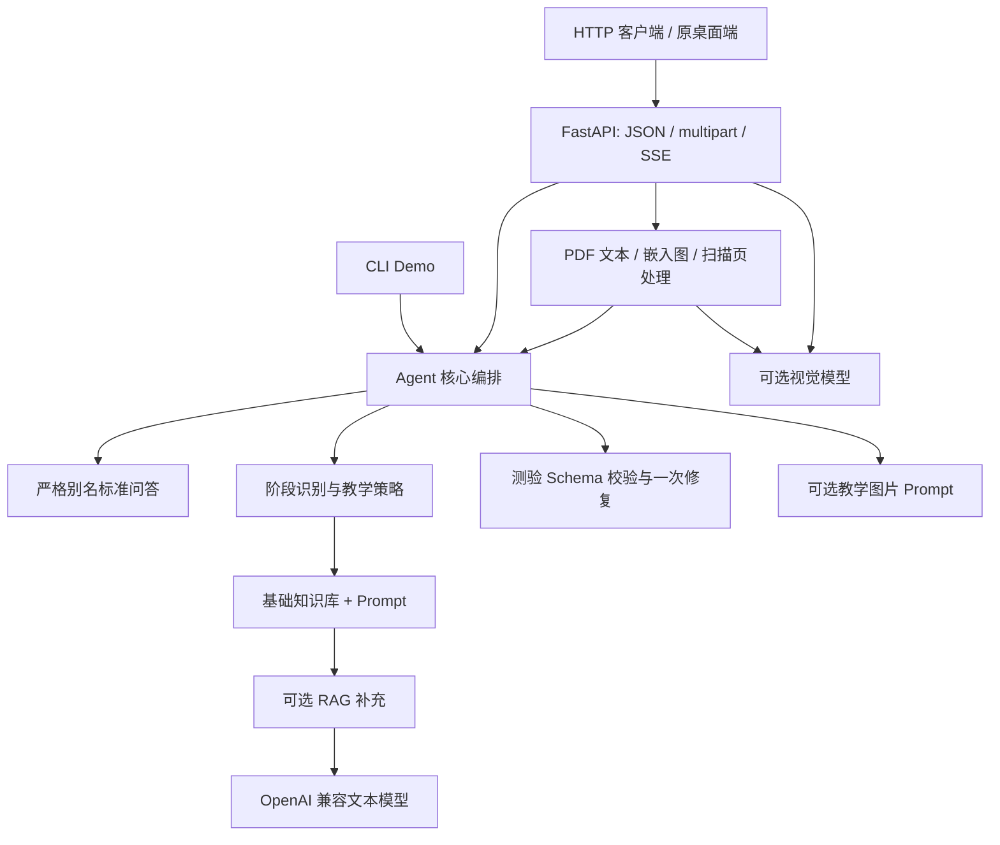

# Michelson AI Tutor

面向迈克尔逊干涉实验的 AI 助教后端，支持阶段化教学问答、结构化预习出题、实验报告检查与可选多模态理解。

本项目从团队开发的迈克尔逊干涉仪实验平台中提取。**作者 Seasoner 独立负责 Agent 后端全部实现**；本仓库仅展示这一部分，不包含团队的 PyQt6 桌面端、相机采集、FFT 数据处理、相位展开或三维重建算法。

这是基于 LLM 的教学工作流后端，不是自主控制实验设备的工具执行型 Agent。当前为本地演示与开发版本，不应直接暴露到公网。代码与教学资产的公开授权检查见 [发布检查清单](PUBLICATION_CHECKLIST.md)。

**先看真实案例**：[引导式问答](showcase/cases/01-guided-tutoring.md) · [结构化出题](showcase/cases/02-quiz-generation.md) · [报告检查与已知误报](showcase/cases/03-report-review.md)。三个案例使用合成输入和真实模型输出，无需配置密钥即可阅读；完整索引见 [演示总览](showcase/README.md)。报告的 mask 遗留要求与题目 q3 的语义重复选项均如实保留和标注。

## 1. 个人贡献与实现证据

| 个人负责内容 | 解决的问题 | 代码入口 |
| --- | --- | --- |
| FastAPI 服务与 SSE 协议 | 对接桌面客户端的文本、文件上传和增量输出 | [api_server.py](api_server.py) |
| 阶段与教学策略编排 | 按预习、现场操作和结果分析切换辅导重点；支持直接回答、引导式、混合策略 | [agent_core.py](agent_core.py)、[prompts/](prompts/) |
| 确定性标准问答 | 严格别名命中时直接返回固定答案，避免模型改写；当前包含 5 组答案、101 个别名 | [standard_qa.py](standard_qa.py)、[assets/standard_qa.json](assets/standard_qa.json) |
| 结构化预习出题 | 校验 3 道选择题和 2 道简答题；不合规输出最多修复重试一次 | [quiz_schema.py](quiz_schema.py) |
| 报告检查与习题反馈 | 基于量规给出诊断和建议分；可附加习题作答检查，不计入原 100 分量规 | [agent_core.py](agent_core.py)、[report_checker_prompt.txt](prompts/report_checker_prompt.txt) |
| 本地 RAG 与降级机制 | 文档切块、索引、检索；缺索引、过期、低置信和异常时回退基础知识库 | [rag_ingest.py](rag_ingest.py)、[rag_retriever.py](rag_retriever.py) |
| PDF 与图片检查 | PDF 文字抽取、嵌入图抽取、扫描页栅格化、视觉模型调用 | [document_loader.py](document_loader.py)、[vision_client.py](vision_client.py) |
| 教学图片增强与回归测试 | 安全文件名校验、关键词选图、静态资源服务；mock 模型与文件处理测试 | [image_assets.py](image_assets.py)、[test_cases/](test_cases/) |

这些是实现范围，不代表已经证明教学效果提升。仓库没有虚构准确率、性能提升或线上用户规模。

## 2. 架构



普通问答先尝试固定答案；未命中时进入模型工作流。阶段包括 `pre_lab`、`during_experiment`、`result_evaluation` 与 `unknown`。教学策略包括 `direct`、`guided`、`hybrid`，支持本轮覆盖与最多三级引导，安全相关问题优先直接处理。

客户端负责会话历史与渲染。后端不提供数据库化会话，`session_id` 不是身份认证。详细行为与边界见 [PROJECT_NOTES.md](PROJECT_NOTES.md)。

## 3. 安装与启动

需要 Python 3.10+。以下 PowerShell 命令均在本仓库根目录执行，不再进入 `source/ai_agent/`。

```powershell
python -m venv .venv
.\.venv\Scripts\python.exe -m pip install -r requirements.txt
Copy-Item .env.example .env
```

编辑本地 `.env`，配置 `DEEPSEEK_API_KEY`、`DEEPSEEK_BASE_URL` 和账户实际可用的 `DEEPSEEK_MODEL`。这些变量名是现有接口约定，也可指向支持相应 Chat Completions 协议的服务；不保证所有兼容服务完全等价。示例模型名是占位值，不可原样用于真实调用。

完整依赖包含 ChromaDB 和 sentence-transformers，其间接依赖可能较大。RAG 默认关闭；安装 Python 包不等于已经构建知识索引。`requirements.txt` 保留原项目要求，尚未提供锁定全部间接依赖的 lock 文件。

```powershell
.\.venv\Scripts\python.exe -m uvicorn api_server:app --host 127.0.0.1 --port 8000
```

另开终端检查：

```powershell
Invoke-RestMethod http://127.0.0.1:8000/health
```

正常结果为 `status=ok`、`service=ai_agent`。交互式 API 文档地址为 `http://127.0.0.1:8000/docs`。健康检查不验证密钥、模型权限、RAG 索引或视觉能力。

CLI Demo：

```powershell
.\.venv\Scripts\python.exe agent_demo/agent.py
```

CLI 直接调用核心模块，不需要启动 Uvicorn；普通模型问答和报告检查仍需有效密钥与网络。

## 4. 演示与接口

提供三个合成输入，不含真实学生数据：

| 输入文件 | 演示目标 |
| --- | --- |
| [examples/chat.json](examples/chat.json) | 预习阶段的引导式问答 |
| [examples/quiz.json](examples/quiz.json) | 显式触发 5 道预习题 |
| [examples/report.json](examples/report.json) | 检查刻意不完整的合成报告片段 |

启动服务并配置模型后：

```powershell
curl.exe -sS http://127.0.0.1:8000/api/agent/chat -H "Content-Type: application/json" --data-binary "@examples/chat.json"
curl.exe -N http://127.0.0.1:8000/api/agent/chat/stream -H "Content-Type: application/json" --data-binary "@examples/quiz.json"
curl.exe -N http://127.0.0.1:8000/api/agent/report-check/stream -H "Content-Type: application/json" --data-binary "@examples/report.json"
```

重新运行可能产生模型费用。[showcase/](showcase/README.md) 保存了 2026-09-14 的三次真实调用快照、原始响应和 SSE 检查汇总；它们不是手写理想答案，也不是模型准确率评测。输入输出与局限一并展示，重新运行的内容可能不同。

主要接口：

| 路由 | 输入 / 说明 |
| --- | --- |
| `POST /api/agent/chat`、`/chat/stream` | JSON 文本问答；可选教学策略与引导等级 |
| `POST /api/agent/report-check`、`/report-check/stream` | JSON 报告内容；可选 `quiz_context` |
| `POST /api/agent/report-check/upload` | multipart PDF，字段 `file` |
| `POST /api/agent/chat/vision`、`/chat/vision/stream` | multipart 图片，字段 `image`；需要开启视觉 |
| `POST /api/agent/report-check/vision`、`/report-check/vision/stream` | multipart 图片或 PDF，字段 `file`；需要开启视觉 |

表中缩写路由沿用 `/api/agent` 前缀。字段差异以本地 `/docs` 与 [PROJECT_NOTES.md](PROJECT_NOTES.md) 为准。

SSE 事件为 `meta`、`delta`、`done`、`error`；以 `done.answer_markdown` 为最终结果，不要再次拼接到已显示的增量文本后。预习出题虽然仍使用 `answer_markdown` 字段，内容实际是经 Schema 校验的 JSON 字符串，需再次 JSON 解析；校验完成前不输出题目增量。

## 5. 可选能力

**RAG**：在 `.env` 设置 `AI_AGENT_RAG_ENABLED=true`，然后执行：

```powershell
.\.venv\Scripts\python.exe rag_ingest.py build
.\.venv\Scripts\python.exe rag_ingest.py status
```

默认 embedding 为 `BAAI/bge-small-zh-v1.5`，首次构建可能下载模型。索引写入 `rag_index/`，不上传 GitHub。基础知识库始终保留，RAG 只补充，不替代核心规则。

**视觉**：设置 `ENABLE_VISION=true`，填写 `ZHIPU_API_KEY`、`ZHIPU_BASE_URL`、`ZHIPU_MODEL_NAME`。扫描 PDF 还需要系统安装 Poppler，并让 `pdftoppm` 可从 PATH 调用；仅安装 `pdf2image` 不够。扫描页栅格化后交给视觉模型，不是 OCR。

**教学图片**：默认启用；跨端口客户端可配置 `AI_AGENT_PUBLIC_BASE_URL` 生成完整图片 URL。图片增强关闭或资源缺失时回退纯文字。作者已确认四张图片均为本人原创，当前未设置开源许可证。

## 6. 测试与验证

```powershell
.\.venv\Scripts\python.exe -m pip install -r requirements-dev.txt
.\.venv\Scripts\python.exe -m unittest discover -s test_cases -p "test_*.py"
```

自动化测试使用 mock 模型与临时文件。`test_cases/test_vision_smoke.py` 是显式运行的真实服务手工脚本，**不要用 pytest 自动收集本目录**；它的顶层函数不是 unittest 用例。该脚本可能调用真实模型，未包含私人测试图片。

独立副本整理时，194 项 unittest 在禁止外网连接的环境中全部通过。具体环境、验证范围和未验证项见 [VERIFICATION.md](VERIFICATION.md)。这一结果不代表模型回答准确率或完整生产部署验收。

## 7. 已知限制与公开边界

- 原实验数据处理主流程已停用 mask，但部分 Prompt、基础知识库和 RAG 文本仍将 mask 写成证据项，可能造成报告误报。本次提取未改业务内容，也未修复该问题。
- 报告分数是建议分，需教师复核；模型可能误判，不应作为正式自动评分系统。
- 当前不包含鉴权、用户隔离与完整限流，不直接公开服务端口。CORS 不是鉴权。
- HTTP 和 CLI 的部分路径会将输入与输出存到 `outputs/`；不要上传真实报告和会话，使用后需管理本地留存。
- 教学状态依赖客户端回传历史；不能把服务器理解为持久化会话系统。
- 未实现 Word 解析、真正 OCR、设备控制或数据处理算法执行。
- 作者已确认团队允许独立公开，并确认教学图片、基础知识库、标准问答与 RAG 文档均为本人原创。公开署名为 Seasoner；作者选择暂不添加许可证，本仓库当前不标注 MIT 或其他开源许可证。

## 8. 目录与来源

核心源码位于仓库根目录；`prompts/` 为教学提示词，`docs/` 保留基础知识库与标准问答规范，`assets/` 为业务 JSON 和图片，`rag_docs/` 为扩展资料，`test_cases/` 为测试，`agent_demo/` 为 CLI。

- [FILE_MANIFEST.md](FILE_MANIFEST.md)：文件用途、必需程度与排除规则。
- [SOURCE_INVENTORY.csv](SOURCE_INVENTORY.csv)：57 个原样提取文件的来源路径、大小和 SHA-256。
- [AGENTS.md](AGENTS.md)：后续编码助手的修改约束。
- [PROJECT_NOTES.md](PROJECT_NOTES.md)：维护与交接说明。
- [showcase/README.md](showcase/README.md)：三个真实调用案例、个人实现对应关系、演示讲解与内容风险。

提取来源为 `michelson-project` 中的 `source/ai_agent/`，来源 HEAD 为 `39d1a5354c71a5e750be1136aa8d70e4a4809adc`；提取的是当时工作区文件，逐文件哈希是实际快照依据。未复制原项目 `.git`，不携带旧提交历史，也不会自动同步团队仓库。
